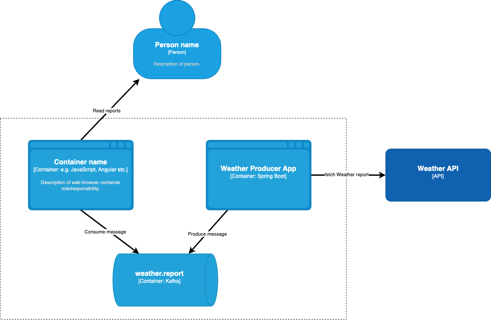

# Weather Monitor App

Application monitoring weather in a given city.

> IMPORTANT
> This is a test application created to help in the process of *Kubernetes* learning.

## Overview



## Running the application in docker containers

Prerequisites:
- docker
- mvn
- api key for [weather api](https://www.weatherapi.com/my/)

1. Export weather api key
   `export WEATHER_API_KEY=<API_KEY>`
2. Run the script:
   `./run.sh`

This will create containers: broker, producer and consumer.

## Running locally (e.g. for debugging)

1. Create kafka broker:
   `docker compose up -d broker`
2. Create topic:

  ```shell
  docker exec -it broker /opt/kafka/bin/kafka-topics.sh \
--create \
--topic weather.report \
--bootstrap-server broker:9092 \
--partitions 3
  ```

3. Run the applications
